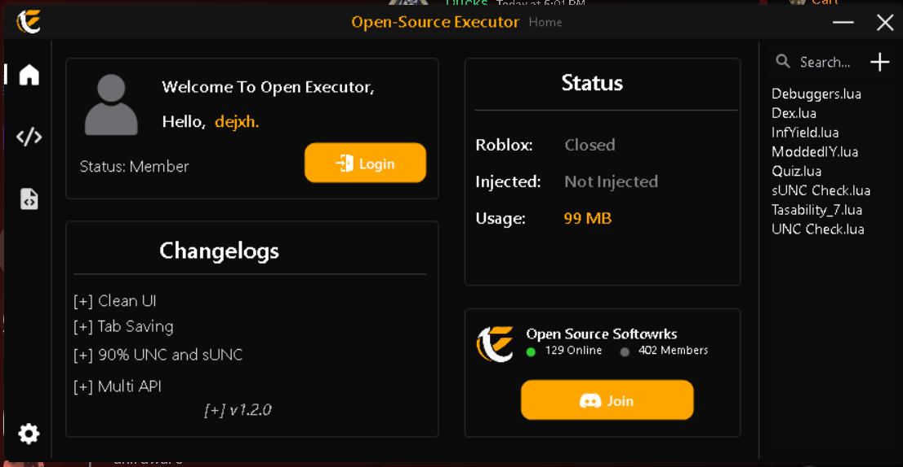
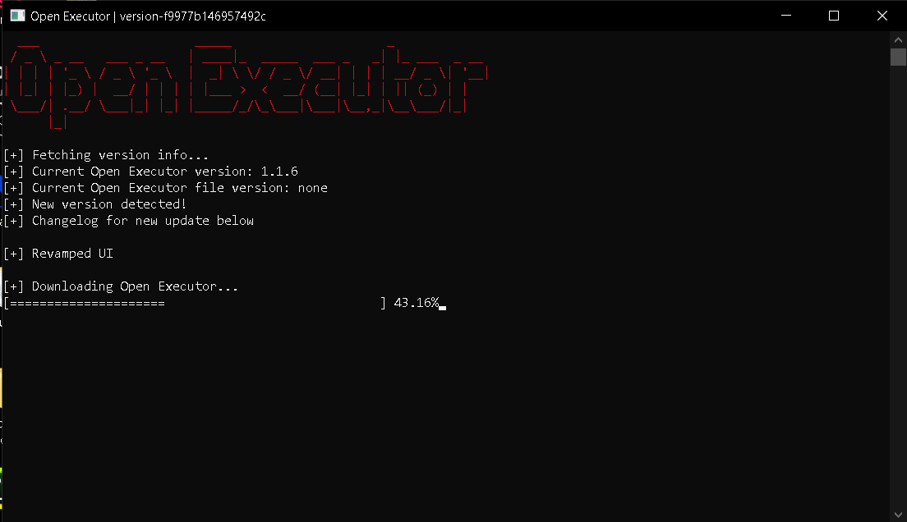

<div align="center">
    
    <h1>Open Executor</h1>
</div>

<h3 align="center">Free, simple, Roblox executor (Open-Source UI).</h3>

<div align="center" style="margin-bottom:12px;">
    <a href="https://open-executor-web.vercel.app/" style="display: flex; align-items: center;">
        
    </a>
    <a href="https://discord.gg/gCWBfGRRNZ" style="display: flex; align-items: center;">
        
    </a>
    <a href="https://x.com" style="display: flex; align-items: center;">
        
    </a>
    <a href="https://buymeacoffee.com" style="display: flex; align-items: center;">
        
    </a>
</div>

<h3 align="center"></h3>

Open Source Softworks provides a robust Executor UI with a open source code, meaning you can fork it, or use it on your own server. Or even you can use it for personal use! Open Exexutor has a built in scriptHub powered by RoScripts. A awesome and modern home tab, and a sleek monaco.
---------------------------------------------------------------------------------------------------
<div align="center">

### 📷 **Screenshots**

</div>



<hr style="border-radius: 2%; margin-top: 60px; margin-bottom: 60px;" noshade="" size="20" width="100%">

<div align="center">

### 🎈 **Open-Source executor is a Roblox executor with many features.**

</div>


## Getting Started

### Downloading

```bash
# To run the Open-Exexutor, please download the latest version and run the Bootstrapper. If its automatically closing; delete version.txt
```

### Using

```bash
# The use can be very wide, you can use it to kickstart your own executor, implement your own api. Or even learn from the code to improve your own Executor!
```

### Thanks for using

```bash
# Thanks for using, please join the discord and support us!
```

